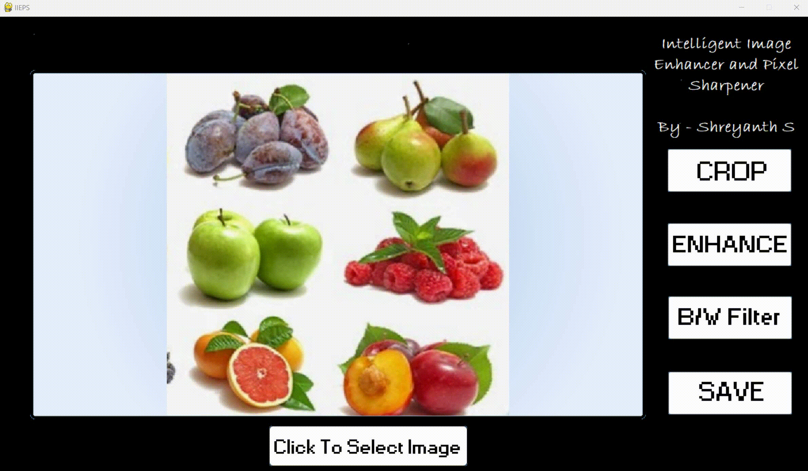
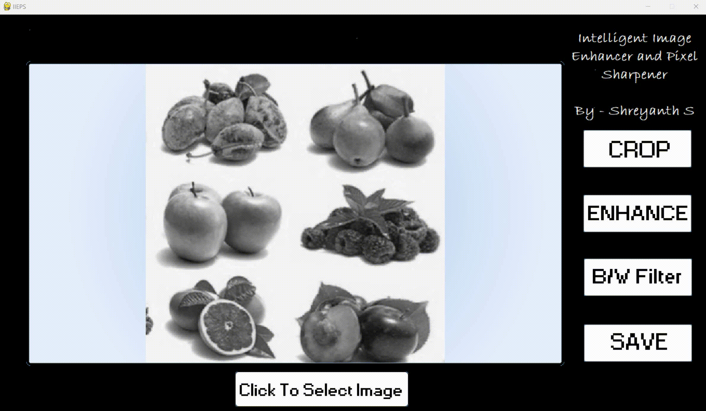
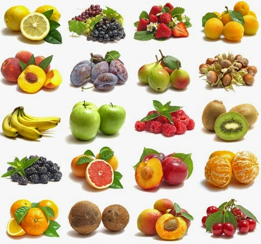
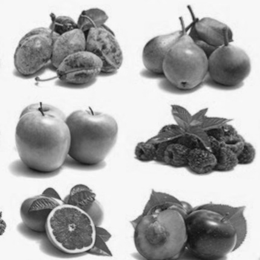
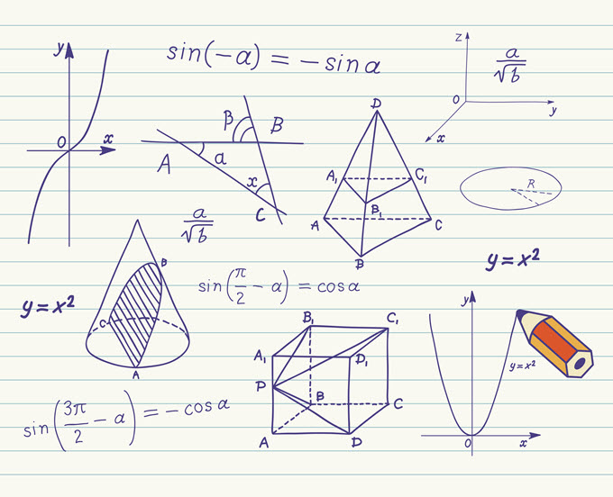
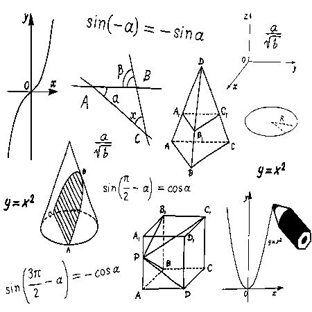
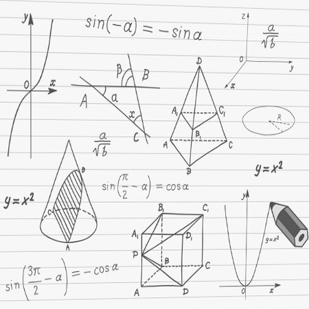

# Intelligent Image Enhancer and Pixel Sharpener:

IIEPS is an image sharpener and a cropping tool. It uses python libraries to open and edit image. It not only enhances the image but also converts into B&W if needed. It has the flexible cropping edges to pull into any form and it is not fixed to a standard line.

**Dependencies:**

The Python libraries used are:

  * Numpy
  * Opencv
  * Pygame
  * Tkinter

To run the program you will need to install required libraries.

Simply run the command "python image_enhancer.py" at the stored location in your CMD to access this.

## Select the image that you want from your local desktop

## To crop your image, set the boundaries for your image and just select the crop option. It will then ask you for the cropped image ratio. You can enter the measurements as per your requirement

## To make the image more vibrant or apply B&W, select the desired option

## Once you are done with your final image then select the save option and it will save it to your desktop

## Sample output images

 

  

## Conclusion
Please test out all the functionalities you wish to explore.
